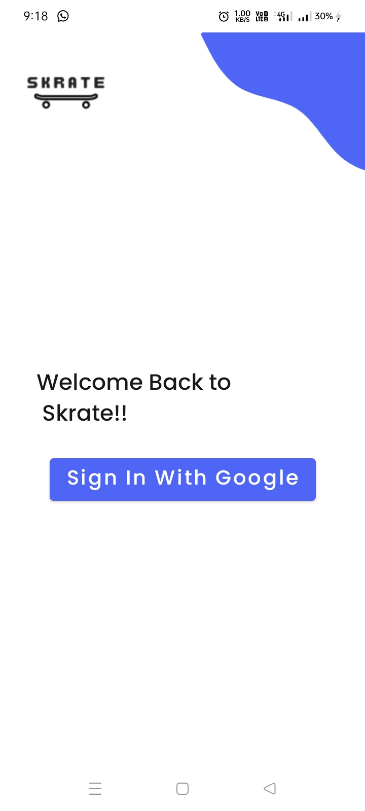
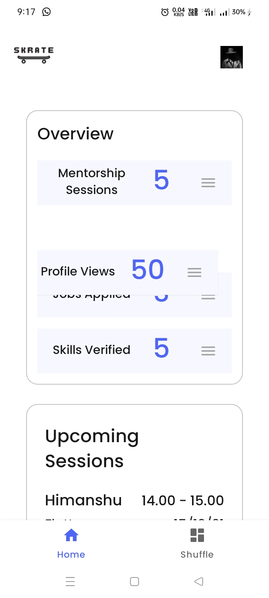
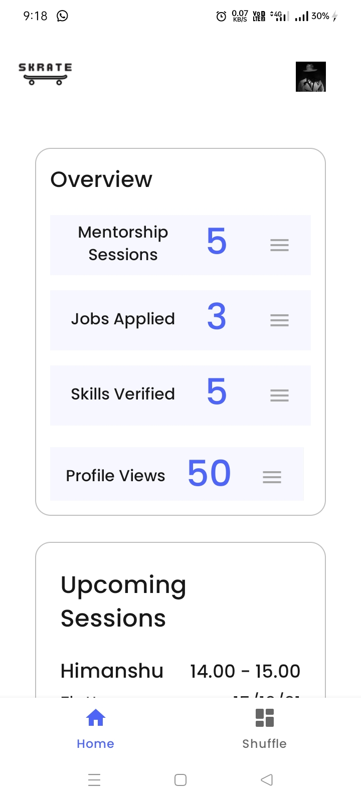

# Skrate_Test_App
## Android application made for Skrate Kotlin Test

Android application made with MVVM architechture.

Uses Firebase Google Sign In Auth for signning and authenticating users.Retrofit is used to handle the API responses given.
OkHttp is used to setup the API call functionality.Glide is used to load the images used in the project.
Coroutines are used to complete the async tasks in the project.

Drag and Reorder functionalities is also there in the overview section to provide User more flexibile UI.

